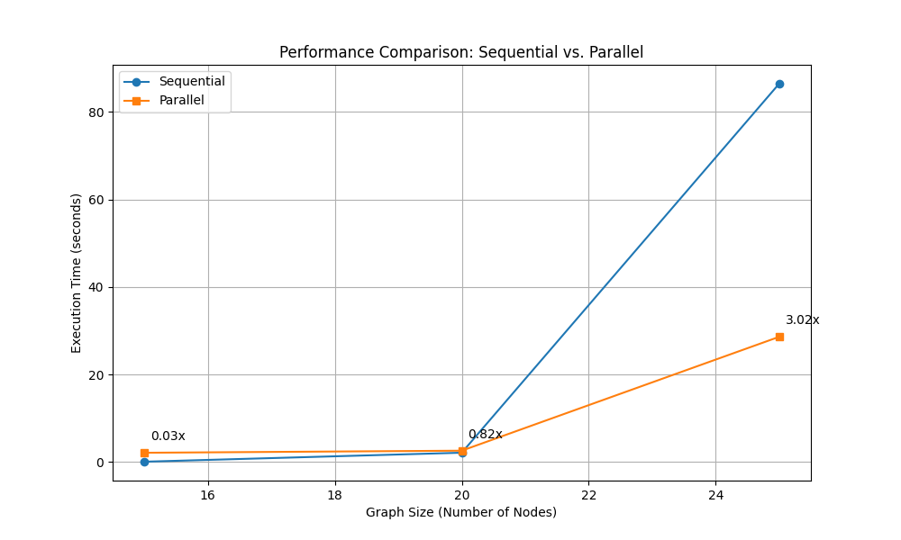

# Parallelized Steiner Tree Algorithms

This document describes the parallelization improvements made to the SteinerNetPy library, specifically targeting the exact algorithm (`_exact_algorithm`) which can be computationally expensive for larger graphs.

## Overview of Changes

The original implementation of the exact algorithm was sequential, iterating through all possible combinations of non-terminal nodes to find the optimal Steiner tree. This approach becomes very slow for graphs with many nodes.

The following improvements have been implemented:

1. **Parallelized Exact Algorithm**: The `_exact_algorithm` function now supports parallel processing using Python's multiprocessing library.
2. **Parallelized EXA+ Algorithm**: The `_exact_algorithm_union_with_neighbour_explore` function also supports parallel processing.
3. **Configurable Parallelization**: Users can control whether to use parallelization and how many processes to use.

## Performance Improvements

The parallelization shows significant performance improvements for larger graphs:

- For small graphs (around 15 nodes), the sequential implementation may be faster due to the overhead of creating and managing multiple processes.
- For medium-sized graphs (around 20 nodes), the parallel implementation starts to show benefits.
- For larger graphs (25+ nodes), the parallel implementation can be several times faster than the sequential one.



## Usage

The parallelization is enabled by default but can be controlled through additional parameters in the `steinertree` method:

```python
import networkx as nx
from steinernet.steiner import SteinerNet

# Create a graph
G = nx.Graph()
# ... add nodes and edges ...

# Create a SteinerNet instance
steiner = SteinerNet(G)

# Run with default parallelization (uses all available CPU cores)
tree = steiner.steinertree(terminals, method='EXA')

# Run with parallelization disabled
tree = steiner.steinertree(terminals, method='EXA', parallel=False)

# Run with a specific number of processes
tree = steiner.steinertree(terminals, method='EXA', parallel=True, n_processes=4)
```

The same parameters work for the 'MEXA' and 'EXA+' methods as well.

## Implementation Details

The parallelization is implemented using Python's multiprocessing library, specifically the `Pool` class and the `map` method. The algorithm divides the work by processing different subsets of non-terminal nodes in parallel.

For each subset of non-terminal nodes:
1. A subgraph is created with the terminals and the subset
2. If the subgraph is connected, a minimum spanning tree is computed
3. The cost of the tree is calculated
4. Trees with the minimum cost are collected

This approach is well-suited for parallelization because each subset can be processed independently.

## Future Improvements

Potential future improvements include:

1. **CUDA Implementation**: For systems with NVIDIA GPUs, a CUDA implementation could provide even greater speedups for very large graphs.
2. **Chunking Strategies**: Optimizing how the subsets are divided among processes could further improve performance.
3. **Memory Optimization**: For extremely large graphs, memory usage could be optimized to handle more nodes efficiently.

## Running the Performance Test

A performance test script is included to compare the sequential and parallel implementations:

```bash
python test_parallel_performance.py
```

This script generates random graphs of different sizes, runs both the sequential and parallel implementations, and produces a performance comparison plot.
